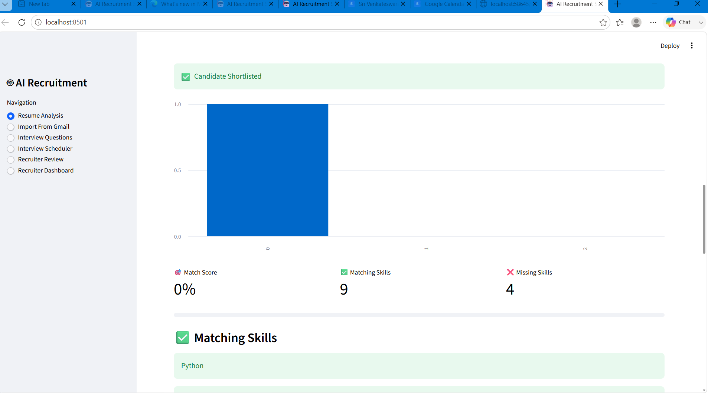
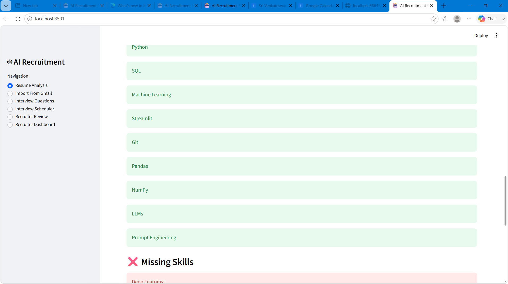
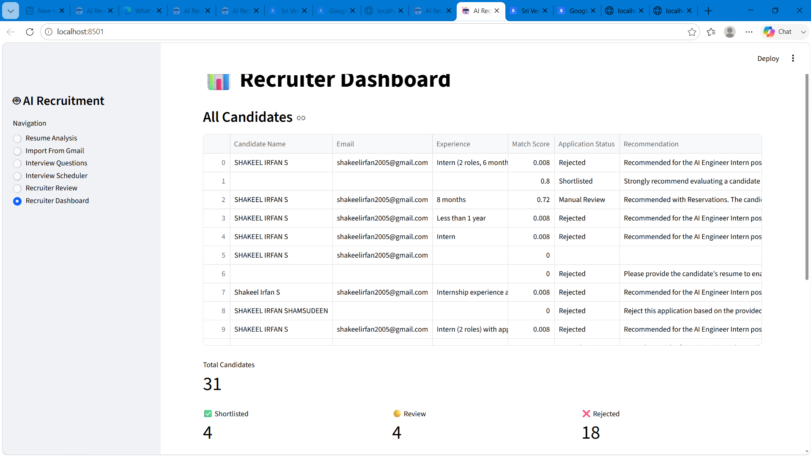
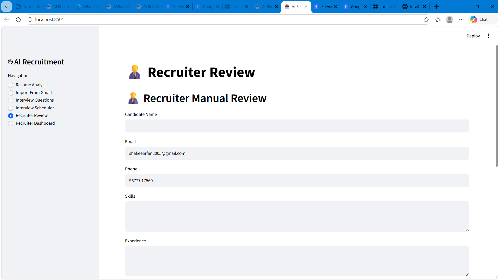
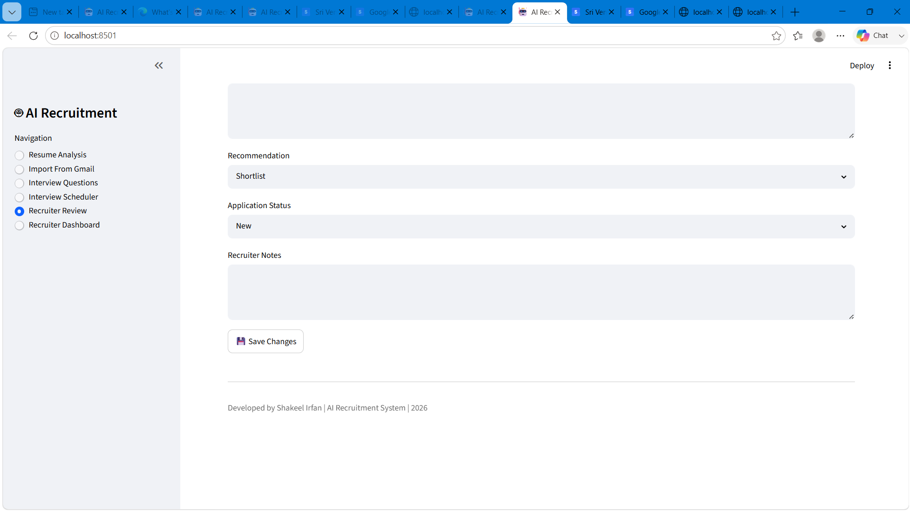
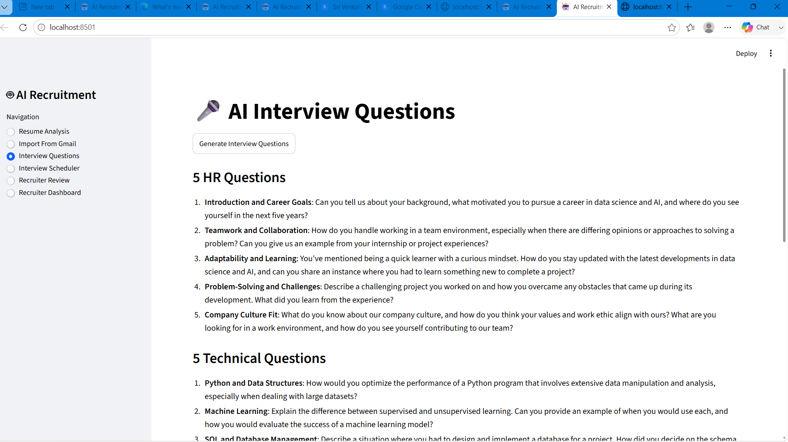
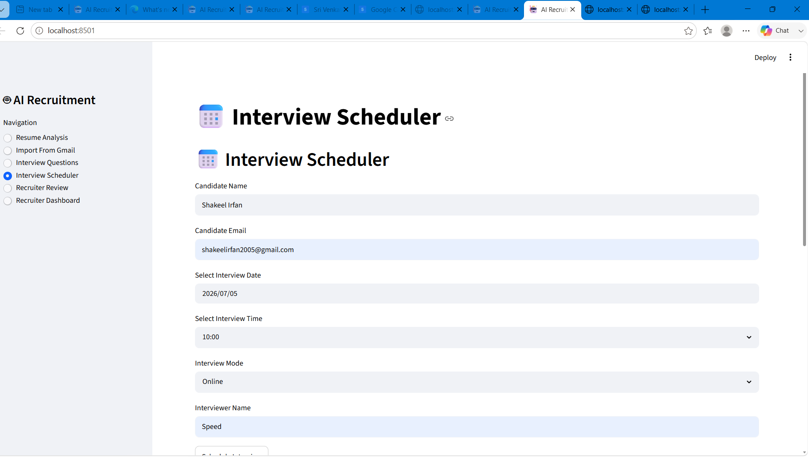
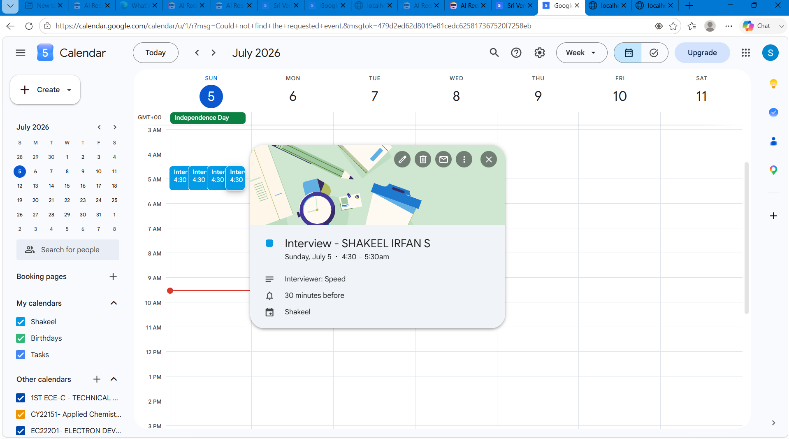
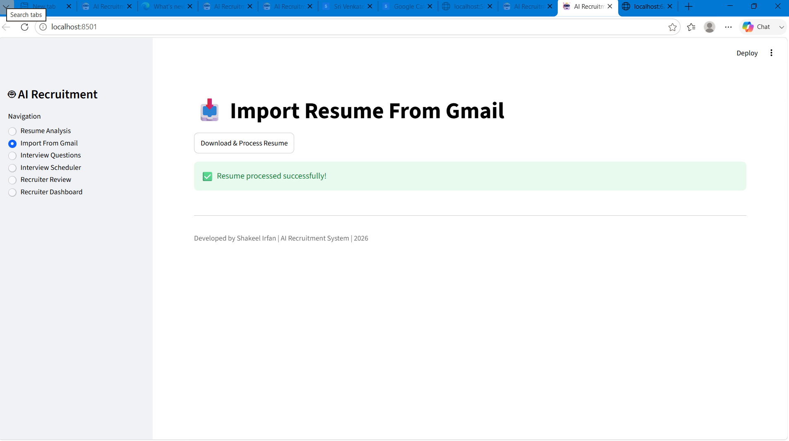

# 🤖 AI Recruitment System

> **An End-to-End AI-Powered Recruitment Automation Platform**

An intelligent recruitment workflow that automates resume screening, candidate evaluation, recruiter review, and interview scheduling using Large Language Models (LLMs), Airtable, Gmail, and Google Calendar.

---

# 📌 Project Overview

Recruiters often spend hours manually reviewing resumes, comparing candidates with job descriptions, shortlisting applicants, and scheduling interviews.

The AI Recruitment System automates this entire workflow while allowing recruiters to review and override AI recommendations whenever required.

This project demonstrates production-oriented AI workflow automation using Python, Streamlit, Groq LLM, Airtable, Gmail API, and Google Calendar API.

---

# 🎯 Objectives

✔ Automate Resume Screening

✔ Extract Structured Candidate Information

✔ Match Candidates with Job Description

✔ Generate AI-Based Match Score

✔ Store Candidate Records

✔ Recruiter Review Dashboard

✔ Interview Scheduling

✔ Email Automation

✔ Calendar Integration

---

# 🚀 Key Features

## 📄 Resume Processing

- Upload Resume (PDF)
- Gmail Resume Import
- PDF Text Extraction
- Resume Parsing

---

## 🧠 AI Resume Parsing

Automatically extracts:

- Candidate Name
- Email Address
- Phone Number
- Location
- Total Experience
- Current Role
- Current Company
- Education
- Technical Skills
- Soft Skills
- Certifications
- Languages
- Projects
- LinkedIn Profile (if available)

---

## 🎯 Job Description Matching

The AI compares the candidate's resume against the provided Job Description and generates:

- Match Score (0–100)
- Matching Skills
- Missing Skills
- Relevant Experience
- AI Summary
- Hiring Recommendation

---

## 👨‍💼 Recruiter Dashboard

- Total Candidates
- Shortlisted Candidates
- Manual Review Candidates
- Rejected Candidates
- Candidate Match Score Visualization

---

## 📝 Recruiter Review

Recruiters can:

- Edit Candidate Information
- Modify AI Recommendation
- Change Candidate Status
- Add Recruiter Notes

---

## 📅 Interview Scheduler

- Schedule Interview
- Send Interview Invitation Email
- Create Google Calendar Event

---

## 📄 Candidate Report

Generate a professional PDF report containing:

- Candidate Information
- Match Score
- AI Summary
- Recommendation

---

## ❓ AI Interview Question Generator

Automatically generates interview questions based on:

- Candidate Skills
- Projects
- Experience
- Job Description

---

# 🏗️ System Architecture

```text
                   Applicant
                       │
                       ▼
              Resume Upload / Gmail
                       │
                       ▼
            PDF Resume Extraction
                       │
                       ▼
                 Groq AI Model
                       │
                       ▼
          Structured Resume JSON
                       │
                       ▼
          Job Description Matching
                       │
                       ▼
            AI Candidate Evaluation
                       │
        ┌──────────────┴──────────────┐
        ▼                             ▼
 Airtable Database          Candidate Report
        │
        ▼
 Recruiter Dashboard
        │
        ▼
 Recruiter Review
        │
        ▼
 Interview Scheduler
        │
   ┌────┴────┐
   ▼         ▼
Email      Calendar
```

---

# 🔄 Complete Workflow

```text
Resume Upload
      │
      ▼
PDF Text Extraction
      │
      ▼
AI Resume Parsing
      │
      ▼
Structured JSON Validation
      │
      ▼
Job Description Matching
      │
      ▼
Match Score Generation
      │
      ▼
Store Candidate in Airtable
      │
      ▼
Recruiter Dashboard
      │
      ▼
Recruiter Review
      │
      ▼
Interview Scheduling
      │
      ▼
Email Notification
      │
      ▼
Google Calendar Event
```

---

# 📊 Candidate Life Cycle

```text
Application Received
        │
        ▼
Resume Parsed
        │
        ▼
AI Screening
        │
        ▼
JD Matching
        │
        ▼
Match Score Generated
        │
        ▼
Shortlisted / Review / Rejected
        │
        ▼
Recruiter Approval
        │
        ▼
Interview Scheduled
        │
        ▼
Email Notification
        │
        ▼
Google Calendar Event
```

---

# 📁 Project Structure

```text
AI-Recruitment-System
│
├── app.py
├── requirements.txt
├── README.md
├── AI_PROMPTS.md
├── DATABASE_SCHEMA.md
├── WORKFLOW.md
│
├── data
│   ├── resumes
│   └── job_description.txt
│
├── modules
│   ├── ai_extractor.py
│   ├── airtable_manager.py
│   ├── calendar_scheduler.py
│   ├── dashboard.py
│   ├── email_sender.py
│   ├── file_reader.py
│   ├── gmail_reader.py
│   ├── interview_generator.py
│   ├── interview_scheduler.py
│   ├── job_matcher.py
│   ├── json_parser.py
│   ├── pdf_generator.py
│   ├── recruiter_dashboard.py
│   ├── recruiter_review.py
│   └── resume_parser.py
│
└── .streamlit
```

---

# 🛠️ Technology Stack

| Category | Technology |
|-----------|------------|
| Frontend | Streamlit |
| Backend | Python |
| AI Model | Groq LLM |
| Database | Airtable |
| Resume Parser | PyMuPDF |
| Email | Gmail SMTP |
| Calendar | Google Calendar API |
| PDF Reports | ReportLab |
| Environment | Python Dotenv |

---

# ⚙️ Installation

Clone the repository:

```bash
git clone <YOUR_GITHUB_REPO_URL>
```

Move into the project directory:

```bash
cd AI-Recruitment-System
```

Install dependencies:

```bash
pip install -r requirements.txt
```

Run the application:

```bash
streamlit run app.py
```

---
# ⚙️ Setup Instructions

## 1. Clone the Repository

```bash
git clone https://github.com/shakeelirfan1/AI-Recruitment-System.git
cd AI-Recruitment-System
```

---

## 2. Create a Virtual Environment

### Windows

```bash
python -m venv venv
venv\Scripts\activate
```

### Linux / macOS

```bash
python3 -m venv venv
source venv/bin/activate
```

---

## 3. Install Dependencies

```bash
pip install -r requirements.txt
```

---

## 4. Configure Environment Variables

Create a `.env` file in the project root.

```env
GROQ_API_KEY=YOUR_GROQ_API_KEY

AIRTABLE_TOKEN=YOUR_AIRTABLE_TOKEN
AIRTABLE_BASE_ID=YOUR_AIRTABLE_BASE_ID
AIRTABLE_TABLE_NAME=Candidates

EMAIL_ADDRESS=YOUR_GMAIL_ADDRESS
EMAIL_APP_PASSWORD=YOUR_GMAIL_APP_PASSWORD
```

---

## 5. Configure Google APIs (Optional)

To enable Gmail Resume Import and Google Calendar Interview Scheduling:

- Enable Gmail API
- Enable Google Calendar API
- Create OAuth Credentials
- Download `credentials.json`
- Place `credentials.json` in the project root
- Authenticate once to generate `token.json`

> **Note:** OAuth credentials are intentionally excluded from this repository for security reasons.

---

## 6. Run the Application

```bash
streamlit run app.py
```

The application will be available at:

```
http://localhost:8501
```


---
# 🔐 Environment Variables

Create a `.env` file with the following variables:

```env
GROQ_API_KEY=

AIRTABLE_TOKEN=

AIRTABLE_BASE_ID=

AIRTABLE_TABLE_NAME=

EMAIL_ADDRESS=

EMAIL_APP_PASSWORD=
```

---

# 📂 Database

The project uses **Airtable** to store:

- Candidate Information
- Match Score
- Skills
- AI Summary
- Recruiter Notes
- Application Status
- Resume Attachment

---
# SCREENSHOTS
# 📸 Application Screenshots

## 📄 Resume Analysis



---

## 🤖 AI Resume Extraction



---

## 📊 Recruiter Dashboard



---

## 👨‍💼 Recruiter Review



---

## ✅ Recruiter Final Review



---

## ❓ Interview Question Generator



---

## 📅 Interview Scheduler



---

## 📆 Google Calendar Integration



---

## 📧 Email Notification


```

---

# 🌐 Streamlit Deployment

The application can also be deployed on Streamlit Cloud.

### Supported Features

- Resume Upload
- AI Resume Parsing
- Job Description Matching
- Candidate Scoring
- Airtable Integration
- Recruiter Dashboard
- Recruiter Review
- PDF Report Generation

### Local-Only Features

The following features require Google OAuth authentication and are demonstrated in the local environment:

- Gmail Resume Import
- Google Calendar Interview Scheduling

These features require user-specific OAuth credentials and are therefore not enabled in the public deployment.
---
# 🌐 Live Demo

**Streamlit App:**

https://ai-recruitment-system-dhjbxswtcshgytsazgmcj6.streamlit.app/

## ⚠️ Known Limitation

The **Resume Upload** workflow is fully functional in the deployed application.

The **Import Resume from Gmail** feature is intended for local execution because it requires Google OAuth authentication (`credentials.json` and `token.json`), which are not included in the public repository for security reasons.

To use the Gmail integration:

1. Create Google OAuth credentials.
2. Download `credentials.json`.
3. Configure the required environment variables.
4. Run the application locally.

This design protects sensitive credentials while keeping the application secure.
---
# 📈 Future Enhancements

- Duplicate Candidate Detection
- Semantic Resume Matching using Embeddings
- Multiple Job Description Support
- Candidate Ranking Dashboard
- Slack Notifications
- Microsoft Teams Integration
- Production OAuth Authentication
- Logging & Monitoring
- Unit Testing
- Docker Deployment

---

# 📽️ Demonstration

The project demonstrates:

- Resume Upload
- Resume Parsing
- AI Extraction
- Job Description Matching
- Candidate Scoring
- Airtable Integration
- Recruiter Dashboard
- Recruiter Review
- Interview Scheduling
- Email Automation
- Google Calendar Integration
- Candidate Report Generation

---

# 👨‍💻 Author

**Shakeel Irfan**


AI Engineer Hiring Assignment

---

# 📜 License

This project has been developed solely for the AI Engineer Hiring Assignment and is intended for evaluation purposes.